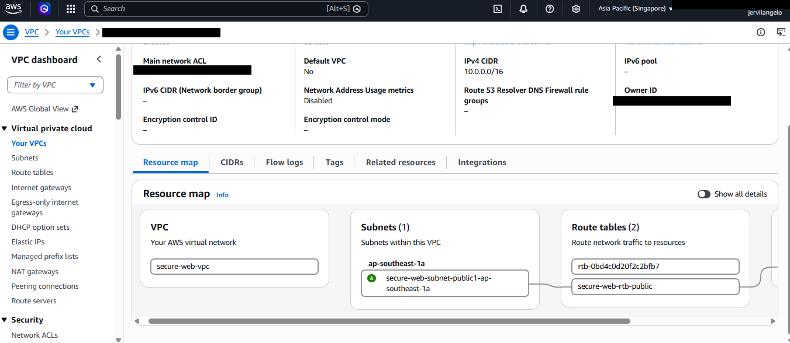
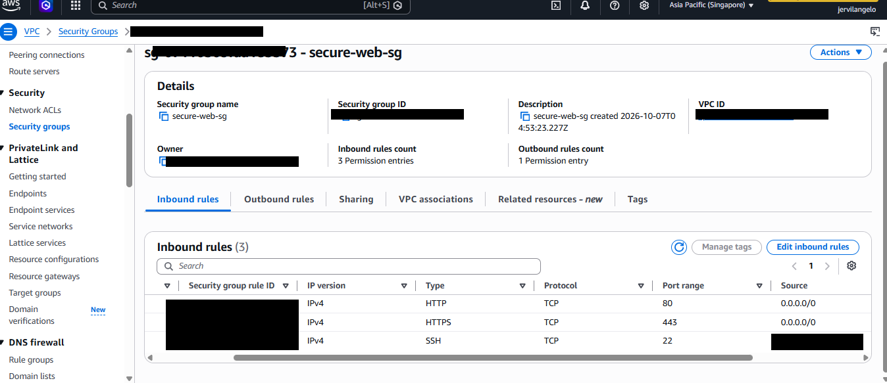
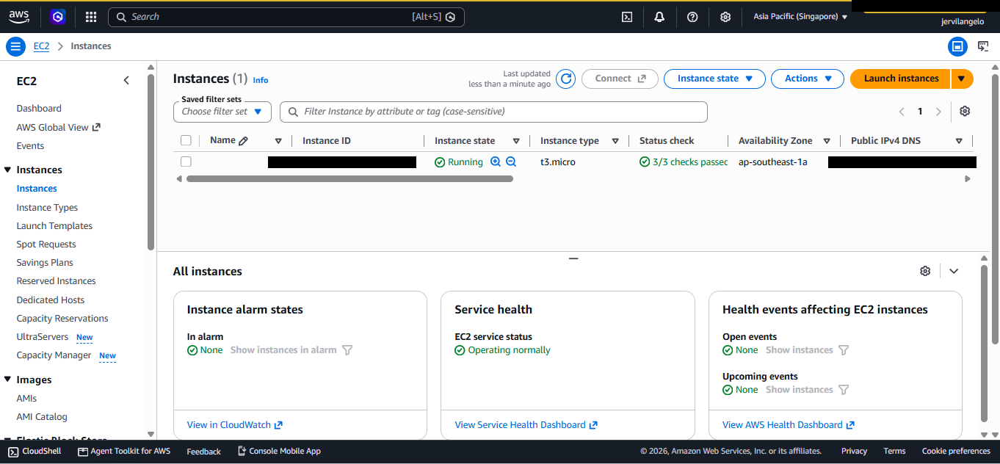
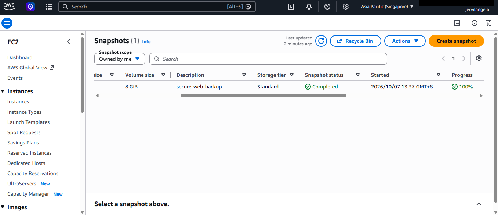
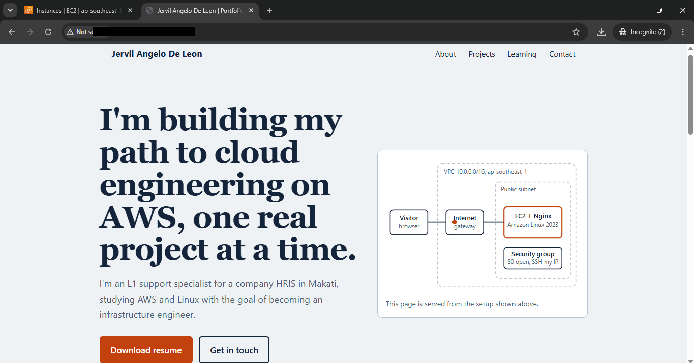
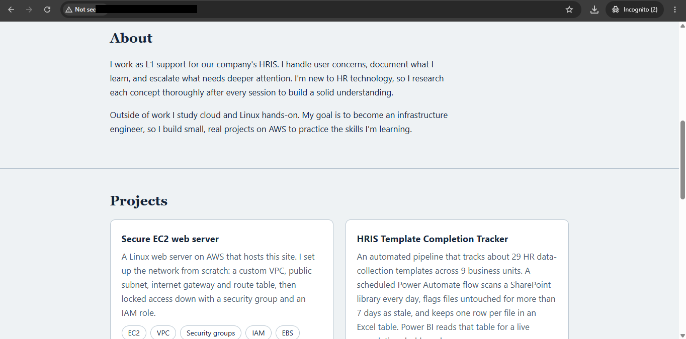
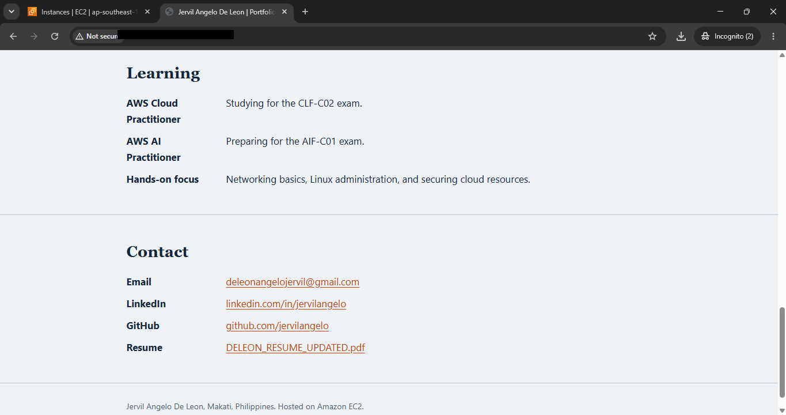

# Secure EC2 Web Server

A portfolio site hosted on Nginx running on an Amazon EC2 instance inside a custom VPC on AWS.

## What I built
- Custom VPC (`10.0.0.0/16`) with one public subnet in `ap-southeast-1` (Singapore)
- Internet gateway and a public route table
- EC2 instance running Amazon Linux 2023 and Nginx
- Security group allowing HTTP (80) from anywhere and SSH (22) from my IP only
- IAM role attached to the instance for Session Manager access
- EBS snapshot as a backup

## Services used
EC2, VPC, Security Groups, IAM, EBS, Linux (Nginx)

## Architecture

## Security
- Root account protected with MFA, daily work done with an IAM user
- SSH restricted to my IP address
- No NAT gateway, to avoid unnecessary cost
- Budget alert set to avoid unexpected charges

## Server and backup

## Result

## How I deployed the site
1. Connected over SSH using the key pair
2. Copied `index.html` to the server with `scp`
3. Moved it into `/usr/share/nginx/html/` and set permissions with `chmod 644`

## Problems I solved
- **SSH "Permission denied":** I was running the command from the wrong folder, so SSH could not find the `.pem` key. Using the full path to the key fixed it.
- **`sudo` error on Windows:** I ran Linux commands in my PC's PowerShell instead of the server session.

## What I learned
Hands-on practice with VPC networking, security groups, IAM, EBS snapshots, and the shared responsibility model.

## Cleanup
Stopped the instance when not in use and deleted resources I no longer needed to avoid charges.
